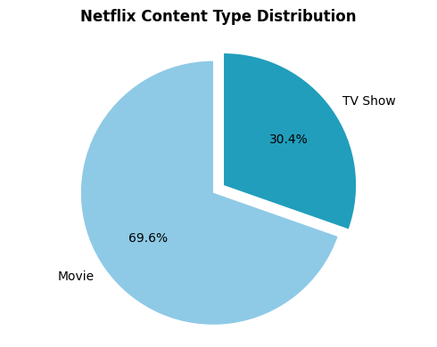
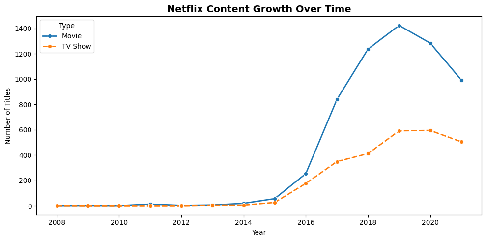
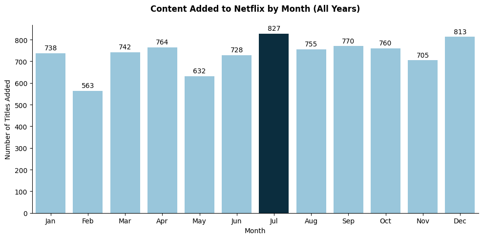
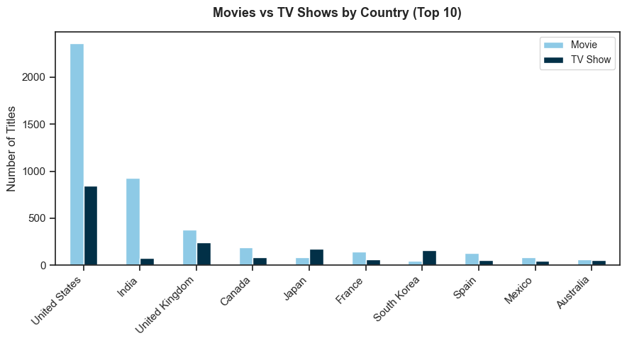
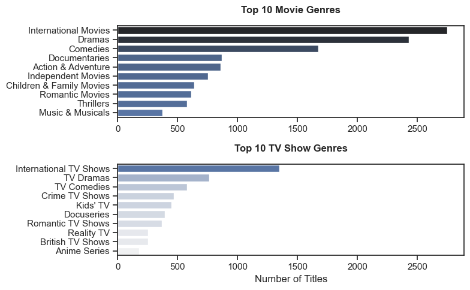
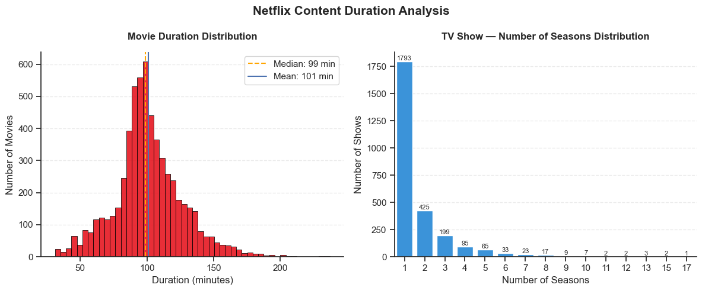

# Netflix Content Analysis — A Comprehensive EDA

A deep exploratory analysis of the Netflix catalog to answer questions that matter both to data scientists and to anyone curious about how the world's most influential streaming platform operates:

- How has Netflix's content strategy evolved over time?
- Which countries produce the most content on the platform?
- Is Netflix primarily a movie platform or a TV show platform?
- What genres dominate, and how do they differ between movies and shows?
- When does Netflix release content — and does timing matter?


# 🛠️ Tools I Used

For my deep dive into the Netflix content analysis, I harnessed the power of several key tools:

- **Python** — The backbone of my analysis, used to clean, process, and extract critical insights from the Netflix dataset. Key libraries include:
    - **Pandas** — Data manipulation and aggregation (filtering by genre, country, release year, and content type).
    - **Matplotlib** — Core visualizations including bar charts, trend lines, and pie charts.
    - **Seaborn** — Helped me create more advanced visuals.
- **Jupyter Notebooks** — Interactive environment for running scripts alongside inline notes, findings, and charts.
- **Visual Studio Code** — Primary code editor for scripting, debugging, and project organization.
- **Git & GitHub** — Version control and public project sharing, ensuring full history tracking and collaboration.

# 🧹 Data Preparation and Cleanup

This section outlines the steps taken to prepare the data for analysis, ensuring accuracy and usability.

## Import & Clean Up Data

I start by importing necessary libraries and loading the dataset, followed by initial data cleaning tasks to ensure data quality.

```Python
# Importing Libraries
import pandas as pd
import matplotlib.pyplot as plt
import seaborn as sns

# Load Dataset
df = pd.read_csv("D:/Data Analyst/project/Python_Netflix_Content_Analysis/dataset/netflix_titles.csv")

# Data Cleanup
df['date_added'] = pd.to_datetime(df['date_added'].str.strip(), errors='coerce')
df['rating'] = df['rating'].fillna("Unknown")
```

# 📊 The Analysis

Each Jupyter notebook for this project aimed at investigating specific 
aspects of the Netflix content. Here's how I approached each question:

## 1. What type of content does Netflix have more of?

### 🔍 Approach
To find the content split between Movies and TV Shows, I grouped the dataset by `type` and calculated the count and percentage share of each.


```python
plt.figure(figsize=(5, 4))

plt.pie(
    type_counts.values,
    labels=type_counts.index,
    autopct='%1.1f%%',
    explode=[0.05] * len(type_counts),
    startangle=90,
    colors=['#8ECAE6', '#219EBC']
)

plt.show()
```

View my notebook with detailed steps here: [2_movies_vs_shows.ipynb](project_code/2_movies_vs_shows.ipynb)

### 📈 Results


### 💡 Insights

Movies dominate the Netflix library at **69.6%** compared to TV Shows 
at **30.4%**, suggesting Netflix's primary focus remains on film content.

## 2. How has Netflix Content grown over time?

### 🔍 Approach
To understand how Netflix's library has evolved, I grouped the dataset 
by `year_added` and `type`, then plotted the number of titles added each 
year for both Movies and TV Shows separately.

```python
df_type_count = df.groupby(['year_added', 'type']).size().unstack(fill_value=0)

plt.figure(figsize=(10, 5))
sns.lineplot(data=df_type_count, palette='tab10', linewidth=2, marker='o', markersize=6)

plt.show()
```

View my notebook with detailed steps here: [3_growth_over_time.ipynb](project_code/3_growth_over_time.ipynb)

### 📈 Results



### 💡 Insights

- Both Movies and TV Shows saw rapid expansion **from 2015 to 2019** as Netflix shifted from a DVD rental service to a global streaming giant and began heavily investing in original content.
- Movies outnumber TV Shows every year, peaking at **1,400 titles added in 2019**,
- TV show additions stabilized at around **600 titles per year** from 2019 to 2021, suggesting a deliberate cap on investment in series relative to films.
- Both content types drop after 2019, likely reflecting the impact of **COVID-19 production shutdowns** and a strategic shift toward quality over quantity.

## 3. What are Netflix's monthly content addition patterns?

### 🔍 Approach
To identify whether Netflix follows a seasonal content strategy, I extracted the month from `date_added` and counted the total number of titles added per month across all years.

```python
plt.figure(figsize=(10, 5))

colors = [
    '#023047' if value == df_plot['count'].max() else '#8ECAE6'
    for value in df_plot['count'] 
]

sns.barplot(data=df_plot, x='Month_Name', y='count', hue='Month_Name', palette=colors, legend=False)

sns.despine()

for i, value in enumerate(df_plot['count']):
    plt.text(i, value + 15, str(value), ha='center')

plt.show()
```

View my notebook with detailed steps here: [4_monthly_addition_pattern.ipynb](project_code/2_movies_vs_shows.ipynb)

### 📈 Results



### 💡 Insights

- With **827 titles** added, July sees the highest content additions, likely timed to capture summer viewing demand.
- With only **563 and 632 titles**, respectively, February and May see significantly fewer additions, suggesting a lower strategic priority.
- Most months sit in the **728–770 range**, indicating Netflix maintains a steady content pipeline year-round rather than relying heavily on seasonal bursts.

## 4. Which countries produce the most Netflix content?

### 🔍 Approach
To identify the top content-producing countries, I grouped the dataset by `country` and `type`, counted the number of titles per group, and filtered to the top 10 countries by total output.

```python
top_countries = df['primary_country'].value_counts().head(10).index

df_plot = df.pivot_table(index='primary_country', columns='type', aggfunc='size', fill_value=0)
df_plot = df_plot.loc[top_countries]

df_plot.plot(kind='bar', figsize=(9,5), color=['#8ECAE6', '#023047'])

plt.show()
```

View my notebook with detailed steps here: [5_top_producing_country.ipynb](project_code/5_top_producing_country.ipynb)

### 📈 Results



### 💡 Insights

- The United States produces nearly 3x more content than any other country, reflecting Netflix's origins and primary market.
- India's contribution is almost entirely film-driven, consistent with Bollywood's prolific output.
- UK, Canada, France, Spain, Mexico, and Australia all show significantly more Movies than TV Shows.

## 5. What are the most popular genres on Netflix?

### 🔍 Approach
To identify Netflix's most represented genres, I separated the dataset by content type and counted the top 10 genres for Movies and TV Shows individually. Since Netflix titles can belong to multiple genres, I first exploded the `listed_in` column to count each genre separately.

```python
fig, ax = plt.subplots(2, 1, figsize=(8,5))

sns.set_theme(style='ticks')

# Top 10 Movie Genres
sns.barplot(data=movie_top, x='count', y='listed_in', ax=ax[0], hue='count', palette='dark:b_r')
ax[0].legend().remove()
ax[0].set_title('Top 10 Movie Genres', fontweight='bold', pad=15)
ax[0].set_ylabel('')
ax[0].set_xlabel('')

# Top 10 TV Show Genres
sns.barplot(data=tvshow_top, x='count', y='listed_in', ax=ax[1], hue='count', palette='light:b')
ax[1].legend().remove()
ax[1].set_title('Top 10 TV Show Genres', fontweight='bold', pad=15)
ax[1].set_ylabel('')
ax[1].set_xlabel('Number of Titles')
ax[1].set_xlim(ax[0].get_xlim())

plt.tight_layout()
plt.show()
```

View my notebook with detailed steps here: [6_genre_analysis.ipynb](project_code/6_genre_analysis.ipynb)

### 📈 Results



### 💡 Insights

- **International content dominates both categories** — "International Movies" and "International TV Shows" rank 1st in their respective categories, confirming Netflix's strong global content strategy.
- **Dramas and Comedies are the core pillars** — Dramas (~2,400) and Comedies (~1,600) rank 2nd and 3rd for Movies, and TV Dramas (~750) and TV Comedies (~575) mirror this pattern for TV Shows.

## 6. How Long Is Netflix Content?

### 🔍 Approach
To understand Netflix's content length strategy, I split the analysis by 
type. For Movies, I plotted a histogram of runtime in minutes with mean 
and median reference lines. For TV Shows, I plotted a bar chart of season 
counts to understand series longevity.

```python
fig, ax = plt.subplots(1, 2, figsize=(12, 5))

# Movie Duration Distribution
sns.histplot(data=movie_dur['duration_int'], ax=ax[0], color='#E50914', bins=50, edgecolor='black', alpha=0.85)

# TV Show seasons distribution
sns.barplot(data=shows_dur, x='duration_int', y='count', ax=ax[1], color='#2196F3')

plt.show()
```

View my notebook with detailed steps here: [7_duration_analysis.ipynb](project_code/7_duration_analysis.ipynb)

### 📈 Results



### 💡 Insights

- The distribution peaks sharply around this range, with a **median of 99 min** and **mean of 101 min**, confirming Netflix favours standard feature-length films.
- While most films cluster **under 120 minutes**, a long tail extends beyond 200 minutes, indicating a small number of epic or special-format titles.
- A striking **1,793 shows** have only a single season, suggesting Netflix cancels or limits the majority of series after their debut.

## 🧠 What I Learned

Throughout this project, I deepened my understanding of Netflix's content strategy and enhanced my technical skills in Python, especially in data manipulation and visualization. Here are a few specific things I learned:

- Advanced Python Usage: Utilizing libraries such as Pandas for data manipulation, Matplotlib and Seaborn for data visualization allowed me to handle a large, multi-dimensional dataset and produce clear, meaningful charts efficiently.
- Data Cleaning Importance: I learned that thorough data cleaning and preparation are crucial before any analysis can be conducted. The Netflix dataset required handling missing values, parsing date fields, and exploding multi-value columns like `listed_in` and `country` to ensure the accuracy of every insight.
- Content Strategy Thinking: The project emphasized how data can reveal a platform's strategic priorities. Analysing patterns across genre, country, duration, and release timing gave me a clearer picture of how Netflix positions its content library for a global audience.

## 💡 Insights

This project provided several key insights into Netflix's content strategy and global library composition:

- International Content is Netflix's Backbone: The dominance of "International Movies" and "International TV Shows" as the top genres across both categories confirms that Netflix's growth strategy is fundamentally global, not US-centric — despite the US contributing the largest share of total titles.
- Content Volume Peaked and Shifted: Netflix aggressively expanded its library between 2015 and 2019, peaking approximately 1,400 movies added in a single year, before pulling back post-2019, signalling a strategic shift from quantity-driven growth to a more selective, quality-focused content approach.
- Single-Season Shows Dominate: With 66% of TV Shows running for just one season and movie runtimes clustering tightly around 90–110 minutes, Netflix clearly favours concise, self-contained content over long-running commitments, reducing production risk while maximising catalogue variety.

## 🏁 Conclusion

This exploration into Netflix's content library has been incredibly informative, revealing the strategic patterns and global priorities that shape one of the world's largest streaming platforms. The insights gained deepen my understanding of how data can tell a platform's story, from its explosive growth phase between 2015 and 2019, to its post-pandemic pivot toward quality over quantity.

Analysing content across genre, geography, duration, release timing, and growth trends provided a well-rounded view of Netflix's evolving content strategy. 

This project serves as a strong foundation for future explorations, including sentiment analysis of viewer reviews, predictive modelling of content success, and deeper regional breakdowns, and underscores the importance of continuous learning and curiosity in the data field.

## 📁 Project Structure

```
├── datasets/
│   └── netflix_titles.csv                  
│
├── notebooks/
│   ├── 1_clean_dataframe.ipynb
|   ├── 2_movies_vs_shows.ipynb               
│   ├── 3_content_growth_over_time.ipynb    
│   ├── 4_monthly_addition_pattern.ipynb   
│   ├── 5_top_producing_country.ipynb       
│   ├── 6_genre_analysis.ipynb              
│   └── 7_duration_analysis.ipynb           
│
├── resources/
│   ├── growth_over_time.png               
│   ├── monthly_addition_pattern.png        
│   ├── top_producing_country.png           
│   ├── genre_analysis.png                  
│   └── duration_analysis.png              
│              
└── README.md
```

